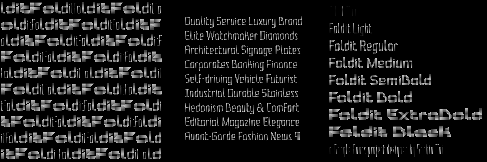

# Foldit Font Project
[![][Fontbakery]](https://sophiadesign.github.io/Foldit/fontbakery/fontbakery-report.html)
[![][Universal]](https://sophiadesign.github.io/Foldit/fontbakery/fontbakery-report.html)
[![][GF Profile]](https://sophiadesign.github.io/Foldit/fontbakery/fontbakery-report.html)
[![][Outline Correctness]](https://sophiadesign.github.io/Foldit/fontbakery/fontbakery-report.html)
[![][Shaping]](https://SophiaDesign.github.io/GF-Foldit/fontbakery-report.html)

[Fontbakery]: https://img.shields.io/endpoint?url=https%3A%2F%2Fraw.githubusercontent.com%2FSophiaDesign%2FGF-Foldit%2Fgh-pages%2Fbadges%2Foverall.json
[GF Profile]: https://img.shields.io/endpoint?url=https%3A%2F%2Fraw.githubusercontent.com%2FSophiaDesign%2FGF-Foldit%2Fgh-pages%2Fbadges%2FGoogleFonts.json
[Outline Correctness]: https://img.shields.io/endpoint?url=https%3A%2F%2Fraw.githubusercontent.com%2FSophiaDesign%2FGF-Foldit%2Fgh-pages%2Fbadges%2FOutlineCorrectnessChecks.json
[Shaping]: https://img.shields.io/endpoint?url=https%3A%2F%2Fraw.githubusercontent.com%2FSophiaDesign%2FGF-Foldit%2Fgh-pages%2Fbadges%2FShapingChecks.json
[Universal]: https://img.shields.io/endpoint?url=https%3A%2F%2Fraw.githubusercontent.com%2FSophiaDesign%2FGF-Foldit%2Fgh-pages%2Fbadges%2FUniversal.json

Foldit is a variable-gradient COLRv1 font which uses gradients to play with dimension and sense of space. Styles run along weight and width axes with two masters: Thin Condensed and Extrabold Expanded. First version is available in GF Latin Plus character set. Concept of this design was, as the name suggest, based on a folded paper strip.

## Project Author

Sophia Tai ([@SophiaTypeLove](http://instagram.com/sophiatypelove)) is an independent typeface designer. She is an alumna of the MA Typeface Design course at University of Reading and was featured on the Malee 2021 Women of Typographic Excellence list.

Links: [website](http://www.sophiatai.com) | [github](https://github.com/SophiaDesign) | [instagram](http://instagram.com/sophiatypelove) | [twitter](http://twitter.com/sophiatypelove) | [twitch](http://twitch.tv/sophiatypelove)

## Project Contributors

- Viviana Monsalve (PM & dev support) | [github](https://github.com/vv-monsalve)
- Khaled Kosny (COLRv1 dev support) | [github](https://github.com/khaledhosny)
- Cosimo Lupo ([FontTools](https://github.com/fonttools/fonttools)) | [github](https://github.com/anthrotype)
- Simon Cozens (dev support) | [github](https://github.com/simoncozens)
- Linh Nguyen (Vietnamese diacritics advice) | [github](https://github.com/Rei-Nguyen)
- Just van Rossum ([FontGoggles](https://fontgoggles.org/)) | [github](https://github.com/justvanrossum)
- Laurence Penney ([Samsa](https://lorp.github.io/samsa)) | [github](https://github.com/Lorp)
- Yanone (general support) | [github](https://github.com/yanone)
- Marc Foley (dev) | [github](https://github.com/m4rc1e)

## Changelog

When you update your font (new version or new release), please report all notable changes here, with a date. [Font Versioning](https://googlefonts.github.io/gf-guide/upstream) is based on semver. 

**26 August 2022. Version 1.000**

- First release. Only the variable font is working correctly.

## Make a contribution

(Last updated: 26 August 2022)

Guide for making your contribution to this project:

1. If you use Glyphs font editing software, **use Glyphs3 or above**. These are the only versions which support COLRv1 gradients. Add your contribution in **Foldit-origin.glyphs** source file to keep an editable version.
2. For COLRv1 feature make sure you only have [native Color layer type](https://glyphsapp.com/learn/creating-an-svg-color-font) selected and no others. 
3. Make a copy of the origin source file and name this **Foldit.glyphs** – place file in **glyphs-decomposed** folder, replace any existing file.
4. In **Foldit.glyphs** file, decompose all elements on all masters and clear background on all layers (for which you can use [Toshi Omagari's script](https://github.com/Tosche/Glyphs-Scripts)). 
5. Follow instructions for automatically building font files in the "Building"section below.
6. You can also generate font files locally using [gftools](https://github.com/googlefonts/gftools) – install python and other dependencies from **requirements.txt**, create a virtual environment (venv) and enter command
`gftools builder config.yaml`

## Building
(This was copied from Unified Font Repository template.) 

Fonts are built automatically by GitHub Actions - take a look in the "Actions" tab for the latest build.

If you want to build fonts manually on your own computer:

- `make build` will produce font files.
- `make test` will run FontBakery's quality assurance tests.
- `make proof` will generate HTML proof files.
The proof files and QA tests are also available automatically via GitHub Actions - look at https://m4rc1e.github.io/Foldit.

## Repository Layout

This font repository structure is inspired by [Unified Font Repository v0.3](https://github.com/unified-font-repository/Unified-Font-Repository), modified for the Google Fonts workflow.

## License

This Font Software is licensed under the SIL Open Font License, Version 1.1.
This license is copied below, and is also available with a FAQ at
[https://scripts.sil.org/OFL](https://scripts.sil.org/OFL)